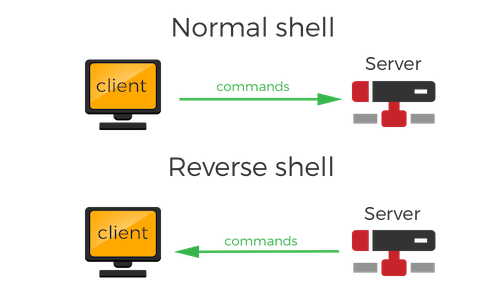
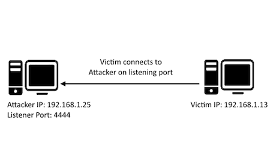

# reverse-shell
<h1>Reverse Shell with Python 3</h1>

<b>Purpose of Reverse Shell:</b>
Connect to someone's computer from anywhere in the world and control it remotely.

<b>Problems of trying to control/hack someone's personal computer:</b>
- personal computers are difficult to connect with directly.
- personal computer's IP is dynamic (always changing) and not public (each computer has a private IP for itself and public IP it is connected to).
- personal computer's firewalls may deny incoming attempts to hack it.

<b>Solution:</b>
- set up a server (server.py) that 'listens' for incoming client connections and have the target computer (client.py) connect to us.
- client's operating system thinks that since the client initiated the connection to the server, it should be a safe connection. 

<b>Uses:</b>
- helping a friend with computer problems by reverse shell into his computer remotely on your computer.
- a system administrator needs to access a bunch of computers remotely for maintenance and execution of commands.
- hackers gain full control into our machines by getting us to run the program in the background unknowingly.

<b>Steps:</b>
1) Attacker's machine (which has a public IP and is reachable over the internet) acts as a server. This is done by running the server.py file. It opens a communication channel on a port and waits for incoming client connections.
2) Victim's machine acts as a client and initiates a connection to the attacker's listening server by running client.py. Currently, the program asks for the server's IP, but in a real-world scenario, the hacker already incorporated the static IP address where his server.py is running into the client.py program.
3) The IP address and port keyed into the input asked by client.py needs to be that of the server. If the hacker is SSH into a server and running the server.py file to execute commands, he needs to have the IP set as static so that clients can connect to the static IP for the hacker to command and control the client's computer. 
4) Commands are sent on the running server.py program through the connection, and executed on the victim's/client's computer.

